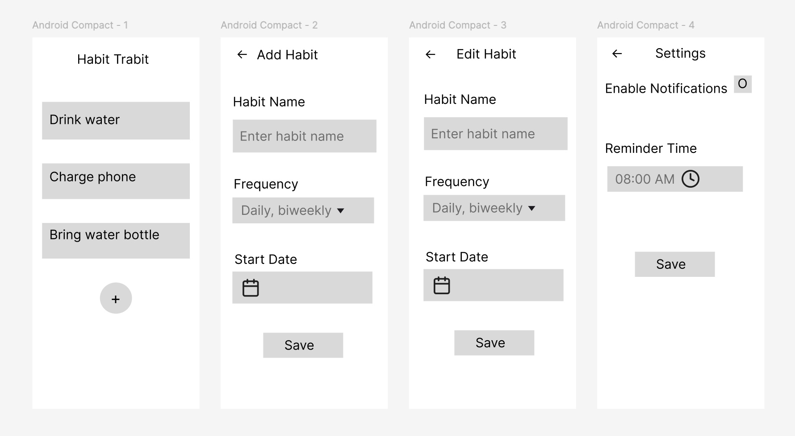

# Habit Tracker App

## 📖 About the Project
Habit Tracker is a simple and intuitive Android app built using Jetpack Compose that helps users track their daily habits. Users can add new habits, edit existing ones, and set reminders for their habits. The app also includes a settings screen where users can enable notifications and configure reminder times. 

## 🎨 Figma Design
Below is the Figma design used to guide the development of this app:

**Figma Link:** [[Link to Figma](https://www.figma.com/design/YUkstVDss2aXojUCpzyZ2R/Habit-Trabit?node-id=0-1&t=THyvTj9uFnxG4Ha7-1)]  
**Figma GIF Video Screen Recording:**
[[Link to GIF Recording](https://imgur.com/gallery/habit-trabit-sRU73VO)]  
**Figma Screenshots:**


## 🚀 Features
The **Habit Tracker** app is made possible by several **Jetpack Compose** and Android features, including:

- **Jetpack Compose UI Components**: `Text`, `Button`, `OutlinedTextField`, `Switch`, `DropdownMenu`, `FloatingActionButton`, etc.
- **State Management with ViewModel**: `viewModel()` and `mutableStateOf()`
- **Navigation**: Switching between Home, Add Habit, Edit Habit, and Settings screens
- **Date & Time Pickers**:  
  - `DatePickerDialog` for selecting habit start dates
  - `TimePickerDialog` for setting habit reminder times
- **Material 3 Design**: Implements modern UI components and theming
- **Icons**: `Icons.Filled.Notifications` for UI enhancements
- **Figma UI Reference**: Designed to match Figma wireframes

## 📦 Dependencies & Libraries
The following libraries and dependencies were used in this project:

```gradle
dependencies {
    implementation(libs.androidx.core.ktx)
    implementation(libs.androidx.lifecycle.runtime.ktx)
    implementation(libs.androidx.activity.compose)
    implementation(platform(libs.androidx.compose.bom))
    implementation(libs.androidx.compose.ui)
    implementation(libs.androidx.material3)
    implementation(libs.androidx.lifecycle.runtime.compose)
    implementation(libs.androidx.lifecycle.viewmodel.compose)

    testImplementation(libs.junit)
    androidTestImplementation(libs.androidx.junit)
    androidTestImplementation(libs.androidx.espresso.core)
    androidTestImplementation(platform(libs.androidx.compose.bom))
    androidTestImplementation(libs.androidx.ui.test.junit4)
    debugImplementation(libs.androidx.ui.tooling)
    debugImplementation(libs.androidx.ui.test.manifest)
}
